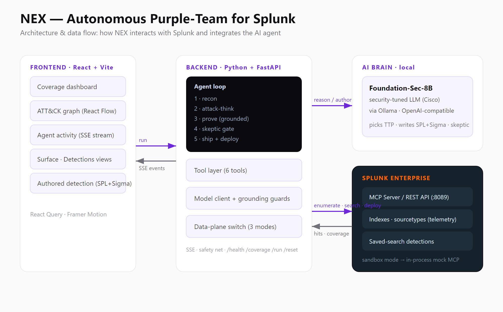

# NEX — Architecture Diagram



How NEX interacts with Splunk, integrates the AI agent, and moves data between services.

```mermaid
flowchart LR
    subgraph UI["Frontend · React + Vite"]
        dash[Coverage dashboard]
        graph[ATT&CK graph · React Flow]
        stream[Agent activity · SSE]
        det[Authored detection · SPL+Sigma]
    end

    subgraph API["Backend · Python + FastAPI"]
        loop["Agent loop:\nrecon → attack-think → prove →\nskeptic → ship"]
        tools[Tool layer · 6 tools]
        brain[Model client + grounding guards]
        plane[Data-plane switch · 3 modes]
    end

    subgraph AI["AI brain · local"]
        fs["Foundation-Sec-8B\nsecurity-tuned LLM (Cisco)\nvia Ollama, OpenAI-compatible"]
    end

    subgraph SPL["Splunk Enterprise"]
        mcp[MCP Server / REST API :8089]
        idx[(Indexes · sourcetypes)]
        saved[(Saved-search detections)]
    end

    mock[(sandbox mode:\nin-process mock MCP)]

    UI -- "run (GET /run)" --> API
    API -- "SSE events" --> UI
    loop --> brain
    brain -- "reason · write SPL+Sigma" --> fs
    loop --> tools --> plane
    plane -- "enumerate · search · deploy" --> mcp
    mcp --> idx
    mcp --> saved
    mcp -- "hits · coverage" --> plane
    plane -. "MODE=sandbox" .-> mock
```

## Data flow (one gap-closing run)

1. **UI → Backend** — `GET /run` opens an SSE stream.
2. **Recon** — `enumerate_coverage` / `map_attack_surface` read real indexes, sourcetypes, and deployed detections via the Splunk data plane.
3. **Attack-think** — the model client asks **Foundation-Sec-8B** for the highest-impact uncovered ATT&CK technique.
4. **Prove** — `count_attack_events` confirms the technique's real telemetry presence (e.g. 301 events) with zero covering detections — proof is grounded in data, not the candidate rule.
5. **Skeptic** — a second model pass checks the real detection list to suppress false positives.
6. **Ship** — the model authors an SPL + Sigma detection; `deploy_detection` writes a real Splunk saved search. Coverage flips 0→1 and the UI graph turns red→green.

**Modes:** `splunk_rest` (live REST), `mcp` (Splunk MCP Server), `sandbox` (in-process mock — zero Splunk setup). The agent loop, prompts, and UI are identical across all three.
